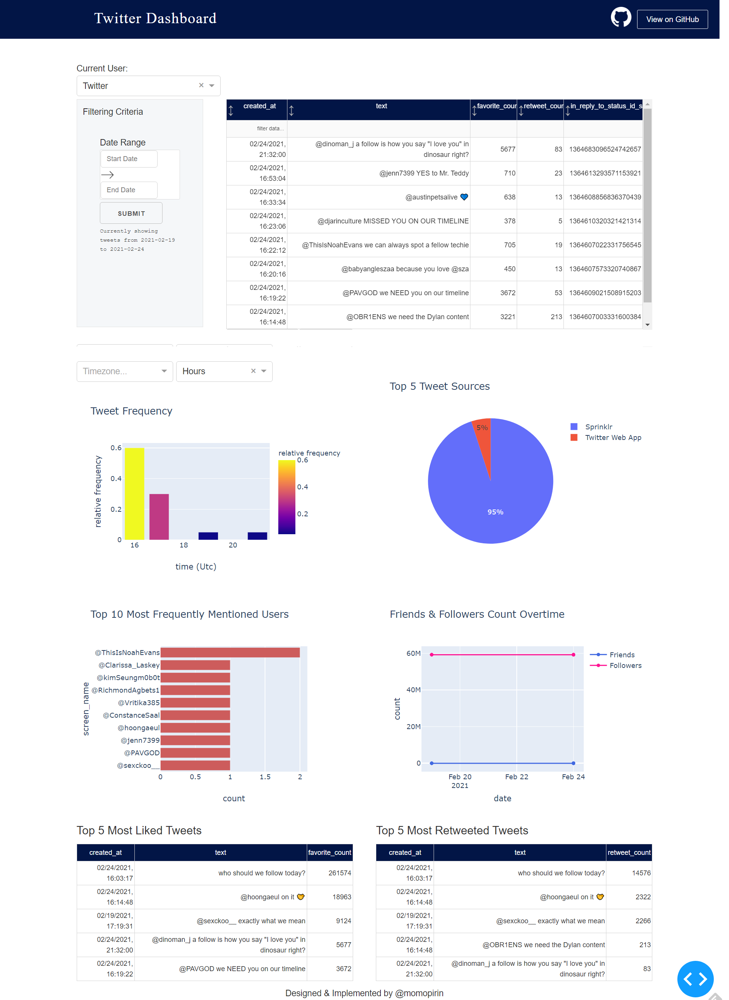

# Twitter Dashboard

A way to visualize archived tweets. Built upon the code [here](https://github.com/plotly/dash-sample-apps/tree/master/apps/dash-pk-calc).

## About this app

This app shows relevant statistics for tweets within a given timeframe.

Currently implemented plots/data tables:
* Tweets in descending order (i.e. latest first)
* Tweet frequency statistics (in different timezones; hour, day, and weekday view)
* Top 5 tweet sources
* Top 10 most mentioned users
* Following/followers changed overtime (see notes below)
* Top 5 tweets that received most likes
* Top 5 tweets that were retweeted the most

Pending plots/data tables:
* Wordcloud
* Protected/unprotected comparison
* ... your thoughts!

## How to run this app

(The following instructions apply to Anaconda/bash. Windows users should check
[here](https://docs.python.org/3/library/venv.html).)

First, clone this repository and open a terminal inside the root folder.

Create and activate a new virtual environment (recommended) by running
the following: ~~(note: Python > 3.6.0 required, or there will be compatibility problems)~~ **Recommend: Python 3.6 - you may run into dependency issues with 3.7 or above**

```bash

conda create -n myenv python=3.6.1

conda activate myenv

```

Install the requirements:

```bash
pip install -r requirements.txt
```

Tweets should be saved in a format similar to `sample_tweets.json`. If interested, you may go ahead and run the app by typing `python app.py` and it should show the content from the `sample_tweets.json`. Note: the file contains a list of json objects directly obtained through Twitter API. If you have tweets from the official Twitter archive, please prepare it in the same manner. You may also use `clean_tweet_js.py` to help convert the file into the acceptable format:

```bash
python clean_tweet_js.py -lp /path/to/tweet.js -o /path/to/output
```

The command above will automatically convert the whole `tweet.js` into `parsed_tweets.json` that is consumable by the app. If you have more than 20,000 tweets, it is recommended to convert the tweets into small batch, similar to the command below:

```bash
python clean_tweet_js.py -lp /path/to/tweet.js -o /path/to/output -b 1000 -e 3000
```

... which will export the 1,000-th to 2,999-th tweets.

Run the app:

1. Run it using the json on the fly: no complicated setup, but paging/results refresh could be slow if your data are large.
* Change line 8 of `environment.py` and pass in the absolute path to your `parsed_tweets.json` file. By default, the path is pointing towards `sample_tweets.json` at the root. 
    * Note: if your `parsed_tweets.json` was obtained by running `clean_tweet_js.py` above, please also change line 9 of  `environment.py` so that the app could correctly load your username and ID. `account.js` could be found in your unzipped Twitter archive, under the `\data` folder. 
2. Run it using a MySQL backbone: setup will take time, but once loaded everything will be fast to compute.
* Substitute secrets in `sample-config.ini` by your configuration
* Create a database schema by following commands in `db_commands.sql`
* Run `json2db.py`. If you're coming from official Twitter archive, the following command should suffice:

```bash
python -s /path/to/config.ini -m local -lp /path/to/data_folder -d 2020-06-15
```

The `data` folder is located in the extracted Twitter archive. Substitute the date following `-d` by the date when you actually obtained the Twitter archive. Also use the `-pchunk` flag to load tweets by small chunks (recommend for users with huge amounts of tweets).
* Uncomment line 4-5 of `environment.py` and pass in the absolute path to your database configuration file under `DATABASE_CONFIG`.

Once you've determined which mode you'd like to view your data, run the following:

```bash
python app.py
```
Open a browser at http://127.0.0.1:8050

## Screenshots



## Notes:
* Still in development mode, annotations will be added soon.
* If tweets are extracted from official Twitter archive, the "media" table won't be loaded in your database. Also, the following/follower plot won't work as there's no information associated with the tweet content.
* Following/followers changed overtime plot will not show properly if you're loading your tweet archive for the first time. As for now users could only request Twitter archive every month. Once you've loaded tweets overtime it should work properly.
